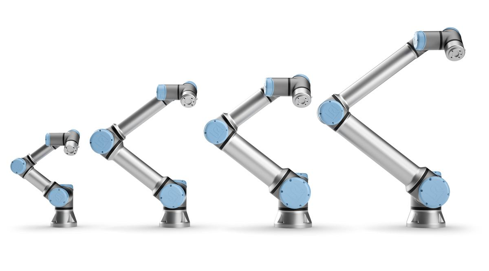

# Universal_Robots_Isaac_Driver

Universal Robots have become a dominant supplier of lightweight, robotic manipulators
for industry, as well as for scientific research and education. It is the core
value of Universal Robots, to empower people to achieve any goal within automation.

<center></center>

The goal of this driver is to provide a stable and sustainable interface between
UR robots and NVIDIA Isaac-SDK that strongly benefit all parties.

NVIDIA Isaac-SDK is the main software toolkit for NVIDIA Robotics. Included in
the Isaac SDK is the ability to easily write modular applications and deploy them
on UR Robots.

If you would like to help **[fill in the Survey](https://share.hsforms.com/19qJ5MI2WQYeDgfi07VAOUQ1kep1)** -
any feedback, suggestion or contribution - is highly appreciated!

Contribution to the driver are welcome.

## Features

- Works for all **CB3 (with software version >= 3.7) and e-Series (software >= 5.1)**
UR robot or simulator. Simulator can be found on [Universal Robots website](https://www.universal-robots.com/download/?option=41508#section41493).

- Can be used with **NVIDIA Jetson hardware platform** see [Universal Robots website](https://www.universal-robots.com/plus/urplus-components/plug-ins-interfaces/jetson-agx-xavier-developer-kit/).

- Transparent **integration of the teach-pendant**. Using the URCaps system, a program
is running on the robot that handles control commands sent from Isaac side. With
this, the robot can be **paused**, **stopped** and **resumed** without restarting
the Isaac driver.

- Use the robot's **speed-scaling**. When speed scaling is active due to safety
constraints or the speed slider is used, this gets correctly handled on the Isaac
side, as well slowing down trajectory execution accordingly.<br/>
   **Note**: Other Isaaac-controllers can be used with this driver, but may behave
   wrong if the speed slider isn't set to 100% or if
   speed scaling slows down the robot. Also, pausing can only be used
   when ur_controller is used.

- **Using UR robots without interacting with the teach pendant** It is possible
to interact with the dashboard server through an Isaac Applications. A codelet serves
as an interface between the dashboardserver on the robot and an Isaac application.
A robot program can e.g. be started and stopped through an Isaac application. For
details see documentation on [DashboardClientIsaac](ur_robot_driver/doc/component_api.md#DashboardClientIsaac)
or documentation on [how to use it](ur_msg/README.md#DashboardClientIsaac-usage).

## How to report an issue

If you encounter any bugs or incomplete functionality please report them as issues.

To create an issue on the [Issue Board](https://github.com/UniversalRobots/Universal_Robots_Isaac_Driver/issues/new)
please use the default template.

## Contents

This repository contains the **ur_robot_driver** and a couple of helper packages,
such as:

- **apps**: Sample applications, which can be used for controlling an UR robot.

- **controller_stopper**: A small external tool that stops and restarts Isaac-controller
based on the robot's state. This can be helpful when the robot is in a state where
it won't accept commands sent from Isaac.

- **ur_controller**: Speed-scaling-aware controller introduced with this driver.

- **ur_msg**: Messages created specific to be used within this driver and to communicate
with this driver. See documentation on how to use [ur_msg in applications](ur_msg/README.md#UR-message-usage)

- **ur_robot_driver**: The actual driver package.

## Requirements

This driver requires a system setup with Isaac SDK. Isaac currently only supports
Ubuntu 18.04 LTS with NVIDIA graphics card drivers see here [Isaac SDK prerequisites](https://docs.nvidia.com/isaac/isaac/doc/setup.html#prerequisites).

The driver requires Isaac SDK version 20202.2. Isaac SDK can be downloaded from
[Isaac download](https://developer.nvidia.com/isaac/downloads), then follow [Isaac setup](https://docs.nvidia.com/isaac/isaac/doc/setup.html)
to install dependencies and set it up.

## Setting up the driver

**Note:** The Isaac driver is build on top of a [C++ client
library](https://github.com/UniversalRobots/Universal_Robots_Client_Library) that
abstracts the robot's interfaces. This
library needs to be cloned together with the C++ client library repository for the
driver to work. See the following setup guide:

1. Create a folder to store the driver and client library

```bash
$ mkdir isaac_driver && cd isaac_driver
```

2. Clone the [Universal_Robot_Client_Library](https://github.com/UniversalRobots/Universal_Robots_Client_Library/tree/boost):

```bash
$ git clone -b boost https://github.com/UniversalRobots/Universal_Robots_Client_Library.git
```

3. Clone this repository

```bash
$ git clone https://github.com/UniversalRobots/Universal_Robots_Isaac_Driver.git
```

4. In this repository create a symlink "ur_client_library" to the client library.

```bash
# /home/username/isaac_driver/Universal_Robots_Isaac_Driver/ur_client_library -> /home/username/isaac_driver/Universal_Robots_Client_Library/

$ ln -s /home/username/isaac_driver/Universal_Robots_Client_Library/ /home/username/isaac_driver/Universal_Robots_Isaac_Driver/ur_client_library
```

5. In the Isaac SDK folder create a symlink "packages/universal_robots" to this repository.

```bash
# /home/username/isaac/sdk/packages/universal_robots -> /home/username/isaac_driver/Universal_Robots_Isaac_Driver

$ ln -s /home/username/isaac_driver/Universal_Robots_Isaac_Driver /home/username/isaac/sdk/packages/universal_robots
```

## Setup the robot

For using the *ur_robot_driver* with a real robot you need to install the **externalcontrol-1.0.5.urcap**
which can be found inside the [**resources**](ur_robot_driver/resources/) folder
of this driver.

**Note**: For installing this URCap a minimal PolyScope version of 3.7 or 5.1 (in
case of e-Series) is necessary.

For installing the necessary URCap and creating a program, please see the individual
tutorials on how to [setup a CB3 robot](ur_robot_driver/doc/install_urcap_cb3.md)
or how to [setup an e-Series robot](ur_robot_driver/doc/install_urcap_e_series.md).

Alternatively to use the driver without the URCap you can activate headless_mode,
when starting the driver, see documentation on [headless_mode](ur_robot_driver/README.md#headless-mode).

## Quick start sample applications

This driver servers as an interface between Universal Robots and Isaac SDK's application.

To start any applications, you have to stand in the Isaac SDK folder, see [Nvidias
documentation](https://docs.nvidia.com/isaac/isaac/doc/getting_started.html). This
driver comes with two sample applications, that can be used to control an UR robot.

For more detailed documentation of launching the applications see the seperate [tutorial](ur_robot_driver/doc/sample_applications.md)

1. The first [application](/apps/simple_joint_control.ipynb) can be run inside the
Isaac SDK folder, with the following command. Remember that you have
to stand in the `isaac/sdk` folder to launch the application.

   ```bash
   $ bazel run packages/universal_robots/apps:simple_joint_control
   ```

   This should open a jupyter notebook in your browser. Follow instructions
   there to manually control joints or digital io channels on the arm.
   Remember to update the ip for the arm and robot generation.

2. The second [application](/apps/shuffle_box_hardware.py) repetitively moves between
two preset waypoints. This app assumes a vacuum pump is connected through the digital
io interfaces. Make sure to update the waypoints based on the
actual setup, and make sure the path between the waypoints are obstacle-free. To
run the application, see below. Remember that you have
to stand in the `isaac/sdk` folder to launch the application.

   ```bash
   $ bazel run packages/universal_robots/apps:shuffle_box_hardware -- --robot_ip "192.168.56.1" --generation "e-series" --headless_mode false
   ```

   For the parameter robot_ip insert the IP address on which the Isaac driver
   can reach the robot. Update generation according to the robot generation
   that you are using, generation is one of *e-series or cb3*. The last argument
   can be used to enable [headless_mode](ur_robot_driver/README.md#headless-mode)
   or not.

3. Both samples can be run on Jetson. Follow [instructions](https://docs.nvidia.com/isaac/isaac/doc/getting_started.html#deploying-and-running-on-jetson)
 to deploy the sample apps.

4. Follow [Nvidias guide](https://docs.nvidia.com/isaac/isaac/doc/tutorials/building_apps.html)
 to build your own applications.

Once any of the applications are running you can start the robot program with loaded
URCap. From that moment on the robot is fully functional. You can make use of the
Pause function or even Stop the program. Simply press the Play button
again and the ISAAC driver will reconnect.

Inside the Application terminal running the driver you should see the output `Robot
ready to receive control commands.`

## Acknowledgement

- This driver is forked from the [Universal Robots ROS Driver](https://github.com/UniversalRobots/Universal_Robots_ROS_Driver),
which is forked from the [ur_modern_driver](https://github.com/ros-industrial/ur_modern_driver).

- NVIDIA for making and maintaining the [Isaac-SDK](https://www.nvidia.com/isaac)
framework and libraries. As well as contributing to making this driver become reality.
