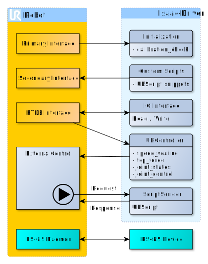

# ur_robot_driver

This package contains the actual driver for UR robots. It is part of the
**Universal_Robots_Isaac_Driver** repository and requires other packages from that
repository. Also, see the [main repository's README](../README.md) for information
on how to setup and startup
this driver.

## Isaac API

This folder comes with 2 codelets:

- **UniversalRobots** The UniversalRobots codelet handles the interface between
an Isaac application and the main driver, which can be found in the
[client library](https://github.com/UniversalRobots/Universal_Robots_Client_Library).
It is publishing actual robot and IO state and receiving IO and arm commands.

- **DashboardClientIsaac** The dashboardClientIsaac class is an interface between
the dashboardserver on the robot and an Isaac application. This codelet is started
through the UniversalRobots codelet. For further details on how to use it [see documentation](../ur_msg/README.md#DashboardClientIsaac-usage).

The components are further documented in a [standalone document](doc/component_api.md)
together with other components from this repository.

### Subgraph

This driver comes with 7 subgraphs, one for each robot model. They set up all
the nescarry parts to use the driver in an application.

- Subgraph for the [ur3](apps/ur3.subgraph.json)

- Subgraph for the [ur5](apps/ur5.subgraph.json)

- Subgraph for the [ur10](apps/ur10.subgraph.json)

- Subgraph for the [ur3e](apps/ur3e.subgraph.json)

- Subgraph for the [ur5e](apps/ur5e.subgraph.json)

- Subgraph for the [ur10e](apps/ur10e.subgraph.json)

- Subgraph for the [ur16e](apps/ur16e.subgraph.json)

These subgraphs integrates
[UniversalRobots](UniversalRobots.hpp), [DashboardClientIsaac](DashboardClientIsaac.hpp)
[ScaledMultiJointController](../ur_controller/ScaledMultiJointController.hpp),
[MultiJointLqrPlanner](https://docs.nvidia.com/isaac/isaac/doc/doc/component_api.html#isaac-planner-multijointplanner)
and [KinematicTree](https://docs.nvidia.com/isaac/isaac/doc/doc/component_api.html#isaac-map-kinematictree)
components. The subgraphs provides the following interface edges:

- **joint_target(input)**: "subgraph/interface/joint_target"

- **stop_control(input)**: "subgraph/interface/stop_control"

- **set_speed_slider(input)**: "subgraph/interface/set_speed_slider"

- **io_command(input)**: "subgraph/interface/io_command"

- **resend_control_script(input)**: "subgraph/interface/resend_control_script"

- **dashboard_command(input)**: "subgraph/interface/dashboard_command"

- **dashboard_anwser(output)**: "subgraph/interface/dashboard_anwser"

- **io_state(output)**: "subgraph/interface/io_state"

- **arm_state(output)**: "subgraph/interface/arm_state"

- **robot_program_running(output)**: "subgraph/interface/robot_program_running"

- **trajectory_executed_succesfully(output)**: "subgraph/interface/trajectory_executed_succesfully"

### Kinematic trees

Isaac SDK uses [kinematic trees](https://docs.nvidia.com/isaac/isaac/doc/manipulation/kinematics.html)
to represent robot arms inside Isaac applications. There is a kinematic tree file
for all robot models

- Kinematic tree file for the [ur3](config/ur3.kinematic.json)

- Kinematic tree file for the [ur5](config/ur5.kinematic.json)

- Kinematic tree file for the [ur10](config/ur10.kinematic.json)

- Kinematic tree file for the [ur3e](config/ur3e.kinematic.json)

- Kinematic tree file for the [ur5e](config/ur5e.kinematic.json)

- Kinematic tree file for the [ur10e](config/ur10e.kinematic.json)

- Kinematic tree file for the [ur16e](config/ur16e.kinematic.json)

**NOTE** All the kinematic tree files assumes that no gripper is connected to the
robot. If the robot is to be used with a gripper, the kinematic tree file can be
extended, with the gripper kinematics. For an example on how to do this see the
kinematic tree file found in `isaac/sdk/apps/assets/kinematic_trees/ur10.kinematic.json`
it has a vacum gripper connected. Also the application [shuffle box hardware](../apps/shuffle_box_hardware.py)
can serve as an inspiration on how to control the gripper.

## Technical details

The following image shows a very coarse overview of the drivers architecture:



The calibration check is not implemented yet. So for now an error will be printed
to the log upon startup.

Real-time data from the robot is read through the RTDE interface. This is done
automatically as soon as a connection to the robot could be established. Thus joint
states and IO data will be immediately available.

To actually control the robot, a program node from the **External Control** URCap
must be running on the robot interpreting commands sent from an external source.
When this program is not running, no controller moving the robot around will be
available, which is handled by the [controller_stopper](../controller_stopper/README.md).
Please see the [initial setup guide](../README.md) on how to install and start the
URCap on the robot.

The URScript that will be running on the robot is requested by the **External Control**
program node from the remote ROS PC. A parameter **control_script_program** can
be used to select a different program than the default one that will be sent as
a response to a program request.

This driver is using [Manipulation Motion Planning](https://docs.nvidia.com/isaac/isaac/doc/manipulation/motion_planning.html)
for any control statements. Therefor, it can be used with all manipulation controllers
available in Isaac SDK. However, we recommend using the controller from the `ur_controller`
package. See it's [documentation](../ur_controllers/README.md) for details. **Note:
Speed scaling support will only be available using the controller from `ur_controller`**

## A note about modes

The term **mode** is used in different meanings inside this driver.

### Remote control mode

On the e-series the robot itself can operate in different command modes: It can
be either in **local control mode** where the teach pendant is the single point
of command or in **remote control mode**, where motions from the TP, starting &
loading programs from the TP activating the freedrive mode are blocked. Note that
the **remote control mode** has to be explicitly enabled in the robot's settings
under **Settings** -> **System** -> **Remote Control**. See the robot's manual for
details.

The **remote control mode** is needed for many aspects of this driver such as

- headless mode (see below)

- many dashboard functionalities such as:
  
  - Powering on the robot and doing brake release

  - Loading and starting programs

### Headless mode

Inside this driver, there's the **headless** mode, which can be either enabled or
not. When the headless mode is activated, required script
code for external control will be sent to the robot directly when the driver starts.
As soon as other script code is sent to the robot, the script will be overwritten
by this action and has to be restarted by sending a signal to [resend_robot_program](./doc/component_api.md)
channel. If this is necessary, you will see the output `Connection to robot dropped,
waiting for new connection.` from the driver. Note that pressing "play" on the TP
won't start the external control again, but whatever program is currently loaded
on the controller. This mode doesn't require the "External Control" URCap being
installed on the robot as the program is sent to the robot directly. However, we
recommend to use the non-headless mode. The **headless** mode might be removed
in future releases.

**Note for the e-Series:** In order to leverage the **headless** mode on the e-Series
the robot must be in **remote_control_mode** as explained above.

## Log handler

The C++ client library comes with its own logging interface. To adjust that logging
interface to make use of Isaac logging a LogHandler has been created.
The `UrclLogHandler` handles messages logged in the C++ client library with Isaac
logging. This loghandler is automatically configured in `UniversalRobots` and `DashboardClientIsaac`.

If you are to use the client library in another node in Isaac, below example can
be used to register the loghandler and set the loglevel:

```c++
#include "UrclLogHandler.hpp"

int main(int argc, char* argv[])
{
  // Initialize UrclLogHandler
  urcl::setLogLevel(urcl::LogLevel::DEBUG);
  isaac::ur_driver::registerUrclLogHandler();
}
```
