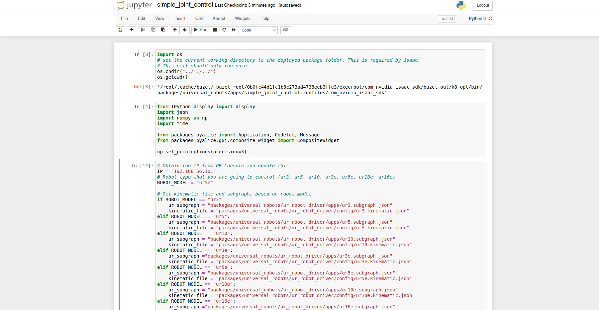

# How to run the sample applications

This tutorial explains how to start the sample applications. Before launching any
application make sure you are placed inside the `isaac/sdk` folder, see [Nvidias
documentation](https://docs.nvidia.com/isaac/isaac/doc/getting_started.html).

## Polyscope

Start by preparing the robot for external control. If you are planning on using
[headless_mode](../README.md#Headless-mode) you can skip this step of the tutorial.

1. For using the *ur_robot_driver* with none headless mode you need to install the
**externalcontrol-1.0.5.urcap** which can be found inside the [**resources**](../resources/)
folder of this driver.

2. For installing the necessary URCap and creating a program, please see the individual
tutorials on how to [setup a CB3 robot](ur_robot_driver/doc/install_urcap_cb3.md)
or how to [setup an e-Series robot](ur_robot_driver/doc/install_urcap_e_series.md).

3. After installing the URCap you should have a Program on your robot looking something
like this.

  

4. Now you are all set to start the applications.

Once any of the below applications are running you can start the robot program with
loaded URCap. From that moment on the robot is fully functional. You can make use
of the Pause function or even Stop the program. Simply press the Play button
again and the ISAAC driver will reconnect.

Inside the Application terminal running the driver you should see the output `Robot
ready to receive control commands.`

## Simple joint control

This applications starts a jupyter notebook in which you can control the robots joints or the robots tool IO.

1. Start by launching the application on the isaac side. Remember that You have
to stand in the `isaac/sdk` folder to launch the application.

   ```bash
   $ bazel run packages/universal_robots/apps:simple_joint_control
   ```

   This should open a jupyter notebook in your browser looking something like this:

   

2. The notebook is divided into different cells, that can be run individually.
The cells can be run by using the run button in the top of the notebook. Start by
running the first two cells. Which imports the nescerray functionality.

3. Next we need to update the IP address on which the Isaac PC can reach the robot.
We also need to update robot model to the robot model that is being controlled by
Isaac, robot models are *ur3, ur5, ur10, ur3e, ur5e, ur10e or ur16e*. The IP and
robot model can be updated in the top of cell 3 see image below.

   

4. After updating the IP and robot we can run the third and fourth cell by using
the run button. The fourth cell will create the class for controlling the joints,
an image can be seen below.

   

5. Cell 5 will start the application. An image for the cell can be seen below:

   

   **NOTE** Before running the cell you
   need to update headless_mode configuration to enabled if you didn't install
   the URCap on the robot. This can be done by changing the *ur_driver.config.headless_mode*
   to true see image above. Same approach can be used to update other configuration
   parameters for the different components in the application.

6. Now you are ready to launch the application by running cell 5.

   **NOTE** If you activated
   *headless_mode* make sure the robot is powered and running and if you are using
   *e-series* that the robot is in remote control.

   After running you should see a panel of 6 sliders, which can be used to control
   each joint individually. And you should see the below terminal output.

   ```bash
   2021-04-29 09:28:48.354 INFO  packages/universal_robots/ur_robot_driver/UniversalRobots.cpp@159: Waiting to receive the first RTDE data

   2021-04-29 09:28:48.362 INFO  packages/universal_robots/ur_robot_driver/UniversalRobots.cpp@162: First RTDE data received

   2021-04-29 09:28:48.362 INFO  packages/universal_robots/ur_client_library/src/ur/dashboard_client.cpp@49: Connected: Universal Robots Dashboard Server

   ```

7. If you didn't activate *headless_mode*, you should start the robot program loaded
on the robot with the URCap after starting the program you should see a terminal
output similar to the one below.

   ```bash
   2021-04-29 09:43:39.921 INFO  packages/universal_robots/ur_client_library/include/ur_client_library/comm/script_sender.h@85: Robot requested program

   2021-04-29 09:43:39.921 INFO  packages/universal_robots/ur_client_library/include/ur_client_library/comm/script_sender.h@98: Sent program to robot

   2021-04-29 09:43:39.934 INFO  packages/universal_robots/ur_client_library/include/ur_client_library/comm/reverse_interface.h@145: Robot connected to reverse interface. Ready to receive control commands.
   ```

   Once you have seen the following terminal output `Robot connected to reverse interface. Ready to receive control commands.` You should be able to control the robots joints.

   Now you can control each joint individually with the slider panel.

   To stop the application again you can run cell 6.

8. If you want to control the IO's instead of the joints, you can run cell 7 instead
of cell 5. Remember to stop the application between running cell 5 and cell 7. This
can be done by running cell 6 or cell 8.

   After running cell 7 you will see a slider panel, which can be used to control
   the robots tool IO.

   **NOTE** The robot program with the URCap doesn't have to be running on the robot
   in order to control the IO's.

## Predefined waypoint movement

This application moves between preset waypoints. Make sure to update the waypoints
based on the actual setup, and make sure that the path between the waypoints are
obstacle-free.

Make sure that you have prepared the robot as stated [above](#polyscope).

1. If you plan on using *headless_mode* make sure the robot is powered on and running.
Also if you are using *e-series* make sure that the robot is in remote control.

2. Start by running the application with the following command.

   ```bash
   $ bazel run packages/universal_robots/apps:shuffle_box_hardware -- --robot_ip "192.168.56.1" --robot_model "ur5e" --headless_mode false
   ```

   For the parameter
   robot_ip insert the IP address on which the Isaac application
   can reach the robot. Remember to update robot model according to the robot model
   that you are using, robot mode is one of *ur3, ur5, ur10, ur3e, ur5e, ur10e or
   ur16e*. headless_mode can be used to enable [headless_mode](../README.md#headless-mode)
   or not.

   After running the above command you should see the following output in the terminal.

   ```bash
   2021-04-29 09:28:48.354 INFO  packages/universal_robots/ur_robot_driver/UniversalRobots.cpp@159: Waiting to receive the first RTDE data

   2021-04-29 09:28:48.362 INFO  packages/universal_robots/ur_robot_driver/UniversalRobots.cpp@162: First RTDE data received

   2021-04-29 09:28:48.362 INFO  packages/universal_robots/ur_client_library/src/ur/dashboard_client.cpp@49: Connected: Universal Robots Dashboard Server
   ```

3. If you didn't activate *headless_mode*, you should start the robot program with
the URCap and you should see a terminal output similar to the one below.

   ```bash
   2021-04-29 09:43:39.921 INFO  packages/universal_robots/ur_client_library/include/ur_client_library/comm/script_sender.h@85: Robot requested program

   2021-04-29 09:43:39.921 INFO  packages/universal_robots/ur_client_library/include/ur_client_library/comm/script_sender.h@98: Sent program to robot

   2021-04-29 09:43:39.934 INFO  packages/universal_robots/ur_client_library/include/ur_client_library/comm/reverse_interface.h@145: Robot connected to reverse interface. Ready to receive control commands.
   ```

   Once you have seen the log message `Robot connected to reverse interface. Ready
   to receive control commands.` the robot should start moving between the predefined
   waypoints.

## Shuffle box hardware

This application moves between preset waypoints. This app assumes a vacuum pump
is connected through the digital io interfaces and the robot model is UR10. Make
sure to update the waypoints based on the actual setup, and make sure that the path
between the waypoints are obstacle-free.

Make sure that you have prepared the robot as stated [above](#polyscope).

1. If you plan on using *headless_mode* make sure the robot is powered on and running.

2. Start by running the application with the following command.

   ```bash
   $ bazel run packages/universal_robots/apps:shuffle_box_hardware -- --robot_ip "192.168.56.1" --headless_mode false
   ```

   For the parameter
   robot_ip insert the IP address on which the Isaac application
   can reach the robot. headless_mode can be used to enable [headless_mode](../README.md#headless-mode)
   or not.

   After running the above command you should see the following output in the terminal.

   ```bash
   2021-04-29 09:28:48.354 INFO  packages/universal_robots/ur_robot_driver/UniversalRobots.cpp@159: Waiting to receive the first RTDE data

   2021-04-29 09:28:48.362 INFO  packages/universal_robots/ur_robot_driver/UniversalRobots.cpp@162: First RTDE data received

   2021-04-29 09:28:48.362 INFO  packages/universal_robots/ur_client_library/src/ur/dashboard_client.cpp@49: Connected: Universal Robots Dashboard Server
   ```

3. If you didn't activate *headless_mode*, you should start the robot program with
the URCap and you should see a terminal output similar to the one below.

   ```bash
   2021-04-29 09:43:39.921 INFO  packages/universal_robots/ur_client_library/include/ur_client_library/comm/script_sender.h@85: Robot requested program

   2021-04-29 09:43:39.921 INFO  packages/universal_robots/ur_client_library/include/ur_client_library/comm/script_sender.h@98: Sent program to robot

   2021-04-29 09:43:39.934 INFO  packages/universal_robots/ur_client_library/include/ur_client_library/comm/reverse_interface.h@145: Robot connected to reverse interface. Ready to receive control commands.
   ```

   Once you have seen the log message `Robot connected to reverse interface. Ready
   to receive control commands.` the robot should start moving between the waypoints.
